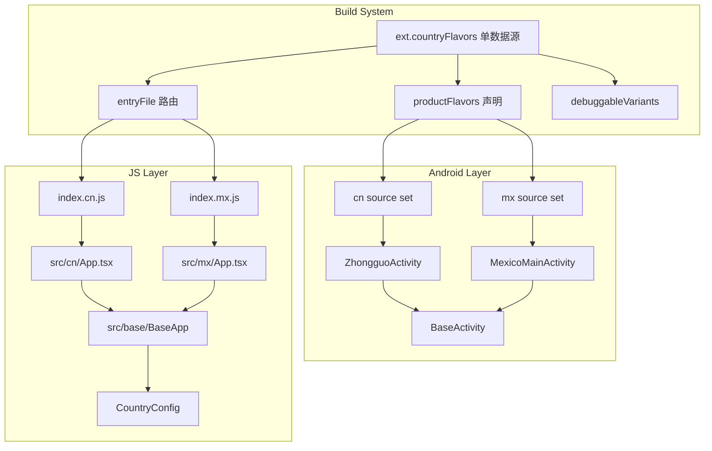

# 一个仓库，多个独立 App：React Native 多国家架构实战

## 背景与痛点

做海外业务的同学对"防关联"这个词一定不陌生。简单说，如果你的公司同时在墨西哥和巴西运营两款 App，一旦应用商店判定它们属于同一开发者，就可能面临关联下架的风险——一个被封，另一个也跟着遭殃。

应用商店的关联检测主要看这几样东西：

- **包名（applicationId / Bundle ID）**：两个 App 用同一个包名，直接判定关联
- **签名证书**：同一个 keystore 签名的 APK，关联
- **资源相似度**：图标、应用名、UI 资源高度雷同，也有一定概率触发关联

所以，"防关联"在技术层面的含义很明确：**不同的 applicationId、不同的签名、不同的资源**。这不是过度设计，而是实打实的业务刚需。

面对这个诉求，最直觉的方案有两个：

**方案一：多仓库。** 每个国家一个独立仓库，完全隔离。问题显而易见——公共逻辑要拷贝 N 份，修一个 bug 要同步 N 个仓库，版本管理混乱，时间一长代码就分叉了。

**方案二：单 APK + 运行时切换。** 一个 App 里内置多国配置，启动时根据地区切换。问题是：所有国家共享同一个包名，一旦下架就是全军覆没，根本达不到防关联的目的。

我们需要的是一种折中方案：**一个代码仓库，但能产出完全独立的多个 App**——包名不同、签名不同、资源不同、JS 代码也是独立的 bundle。

## 方案概览

一句话概括这个架构：**Android product flavors + 独立 JS 入口 + 共享 Base 层。**

核心思路有三个：

1. **构建时区分，而非运行时切换。** 编译阶段就决定了这个 APK 是哪个国家的，用的是哪个 applicationId、哪个 JS 入口文件、哪套图标和名称。不存在"运行时动态切换国家"这回事。

2. **组合而非继承。** 每个国家通过一个 `CountryConfig` 对象声明自己的配置，注入到共享的 `BaseApp` 组件中。国家层不需要继承 Base 层的代码，只需要"传入配置"就能得到差异化的 UI。

3. **单数据源驱动一切。** `build.gradle` 里有一个 `ext.countryFlavors` 的 Map，它是所有差异化的唯一数据源。product flavors 的声明、release bundle 的 entryFile、debuggableVariants 列表，全部从这一个 Map 中派生。添加新国家时，只需要往这个 Map 加一行。

## 架构详解

整个架构分为三层，自底向上分别是 Build System、Android Layer 和 JS Layer：



**依赖关系是单向的：** Country 层依赖 Base 层，Base 层不依赖任何 Country，Country 之间互不依赖。这一点至关重要，后面会专门讲如何保证这个约束。

**数据流也很清晰：** 每个国家的 `App.tsx` 创建一个 `CountryConfig` 对象，传给 `BaseApp`。`BaseApp` 根据 config 渲染差异化的内容（应用名、API 地址、默认语言）。

`CountryConfig` 的接口定义非常简单：

```typescript
export interface CountryConfig {
  apiBaseUrl: string;
  appName: string;
  appIcon: string;
  defaultLocale: string;
}
```

就这四个字段，已经足以让同一个 `BaseApp` 渲染出完全不同的 App。

## 如何做到区分

这是整个架构最核心的部分。我们分 Android 层和 JS 层两条线来讲。

### Android 层：Gradle product flavors

Android 的差异化靠的是 Gradle 的 product flavors 机制。在 `android/app/build.gradle` 里，我们定义了一个 `ext.countryFlavors` Map 作为唯一数据源：

```groovy
ext.countryFlavors = [
    cn: [applicationId: "com.zhongguo.app", jsEntry: "index.cn",
         entryFile: "index.cn.js", activityName: "ZhongguoActivity"],
    mx: [applicationId: "com.mexico.app", jsEntry: "index.mx",
         entryFile: "index.mx.js", activityName: "MexicoMainActivity"],
]
```

注意 `cn` 和 `mx` 的 `applicationId` 完全不同（`com.zhongguo.app` vs `com.mexico.app`），这就是防关联的关键——应用商店看到的两个 App 包名毫无关联。

接着，`productFlavors` 块从这个 Map 动态生成 flavor 声明：

```groovy
flavorDimensions = ["country"]
productFlavors {
    project.ext.countryFlavors.each { name, config ->
        "$name" {
            dimension "country"
            applicationId config.applicationId
            buildConfigField "String", "JS_ENTRY", "\"${config.jsEntry}\""
        }
    }
}
```

这意味着执行 `./gradlew assembleCnDebug` 会打出包名为 `com.zhongguo.app` 的 APK，而 `./gradlew assembleMxDebug` 会打出 `com.mexico.app` 的 APK。

**每个 flavor 还有独立的 source set。** `android/app/src/cn/` 和 `android/app/src/mx/` 各自包含独立的 `AndroidManifest.xml`、Activity 类、资源文件（图标、字符串）。以中国为例，它有独立的 `ZhongguoActivity`：

```kotlin
class ZhongguoActivity : BaseActivity()
```

所有国家的 Activity 都继承自共享的 `BaseActivity`，后者只做了两件事——声明 React Native 的 main component name 和创建 delegate：

```kotlin
abstract class BaseActivity : ReactActivity() {
    override fun getMainComponentName(): String = "MultiCountryDemo"
    override fun createReactActivityDelegate(): ReactActivityDelegate =
        DefaultReactActivityDelegate(this, mainComponentName, fabricEnabled)
}
```

### release bundle 的 entryFile 路由

product flavors 解决了 APK 层面的差异化，但 React Native 还有一个关键问题：**JS bundle 的入口文件。** 每个国家需要打包不同的 JS 入口（`index.cn.js` vs `index.mx.js`）。

我们通过 `afterEvaluate` 钩子，根据 flavor 名称动态覆盖 release bundle task 的 `entryFile`：

```groovy
afterEvaluate {
    tasks.matching {
        it.name.startsWith("createBundle") && it.name.endsWith("JsAndAssets")
    }.configureEach {
        def variantName = it.name.replace("createBundle", "").replace("JsAndAssets", "")
        def flavorName = variantName.replaceAll("(Debug|Release)", "").toLowerCase()
        def config = project.ext.countryFlavors[flavorName]
        if (config != null) {
            it.entryFile.set(file("../../${config.entryFile}"))
        }
    }
}
```

这段代码的意思是：当 Gradle 创建 `createBundleCnReleaseJsAndAssets` 这个 task 时，自动把它的 `entryFile` 设为 `index.cn.js`。同样，`mx` 的 release bundle 会用 `index.mx.js`。

`debuggableVariants` 也从同一个 Map 派生：

```groovy
react {
    debuggableVariants = project.ext.countryFlavors.collect { name, _ -> "${name}Debug" }
}
```

一切数据源都从 `ext.countryFlavors` 这一个入口来。

### JS 层：独立入口 + 独立 bundle

每个国家有一个独立的 JS 入口文件，以 `index.cn.js` 为例：

```javascript
import { AppRegistry } from "react-native";
import { App } from "./src/cn/App";
import { name as appName } from "./app.json";

AppRegistry.registerComponent(appName, () => App);
```

`index.mx.js` 则引入 `./src/mx/App`。两个入口文件结构完全一致，只是指向不同的 App 组件。

Metro bundler 会根据入口文件的不同，打出两个独立的 JS bundle，互不干扰。

### 配置注入与 i18n

每个国家的 `App.tsx` 负责两件事：声明自己的 `CountryConfig`，以及初始化 i18n。以中国为例：

```typescript
const cnConfig: CountryConfig = {
  apiBaseUrl: "https://api.cn.example.com",
  appName: "中国App",
  appIcon: "ic_launcher_cn",
  defaultLocale: "zh-CN",
};

initI18n({ "zh-CN": cnTranslations }, cnConfig.defaultLocale);

export function App(): React.JSX.Element {
  return <BaseApp config={cnConfig} />;
}
```

`initI18n` 的设计也值得一提——它接收国家翻译和 locale，自动将 Base 层的基础翻译（英文）作为 fallback 合并进去：

```typescript
export function initI18n(
  countryTranslations: Record<string, Record<string, string>>,
  locale: string
) {
  const resources = {
    en: { translation: baseTranslations },
    ...Object.fromEntries(
      Object.entries(countryTranslations).map(([lng, translations]) => [
        lng,
        { translation: { ...baseTranslations, ...translations } },
      ])
    ),
  };
  // ...
}
```

这意味着国家的翻译文件只需要覆盖差异部分，缺失的 key 会自动 fallback 到基础翻译。

## 如何防止跨国家引用

架构设计好了，但如果没有工具约束，开发者很容易写出 `import { something } from '../mx/App'` 这样的跨国家引用。一旦中国版代码引入了墨西哥版的模块，打包出来的 JS bundle 就不再干净了。

我们需要两道防线：

### 第一道：ESLint import-boundary 规则

我们编写了一个自定义 ESLint 插件 `eslint-plugin-import-boundary`，它根据文件路径判断当前文件属于哪个"国家"，再检查 import 目标属于哪个"国家"，然后执行以下规则：

| 来源      | 目标      | 结果     |
| --------- | --------- | -------- |
| Country A | Country B | **阻止** |
| Base      | Country   | **阻止** |
| Country   | Base      | 允许     |
| Base      | Base      | 允许     |

核心逻辑非常简洁：

```javascript
function getCountryFromFilePath(filePath, projectRoot) {
  const srcDir = path.join(projectRoot, "src");
  const relative = path.relative(srcDir, filePath);
  const parts = relative.split(path.sep);
  if (parts.length < 2) return null;

  const countryDirs = ["cn", "mx", "br"];
  if (countryDirs.includes(parts[0])) return parts[0];
  if (parts[0] === "base") return "base";
  return null;
}
```

在 ESLint 配置中启用这个规则：

```javascript
module.exports = tseslint.config(
  js.configs.recommended,
  ...tseslint.configs.recommended,
  {
    files: ["src/**/*.{ts,tsx}"],
    plugins: {
      "import-boundary": importBoundaryPlugin,
    },
    rules: {
      "import-boundary/import-boundary": ["error", { projectRoot }],
    },
  }
);
```

这样，任何跨国家的 import 在编辑器里就会直接报错。

### 第二道：Husky pre-commit hook

ESLint 规则只在编辑器里提示还不够——如果开发者无视红色波浪线强行提交呢？我们需要在 Git 提交时再拦一道。

通过 Husky + lint-staged，配置 pre-commit hook：

```bash
# .husky/pre-commit
npx lint-staged
```

`lint-staged` 只会对暂存区（staged）的文件运行 ESLint，既精准又不影响开发体验。如果暂存的文件中存在跨国家引用，`git commit` 会直接失败，违规代码无法入库。

**规则 + 自动执行的组合拳，让约束真正落地，而不是停留在"请大家自觉遵守"的层面。**

## 如何添加新国家

架构再好，如果添加新国家需要手动改十几个文件，那也很容易出错。所以我们提供了一个脚手架脚本，一条命令搞定：

```bash
node scripts/add-country.js <country-code> <application-id> <activity-class-name> [app-name] [api-base-url] [default-locale]
```

比如添加一个巴西市场：

```bash
node scripts/add-country.js br com.brazil.app BrazilActivity "Brazil App" https://api.br.example.com pt-BR
```

脚本会按顺序执行以下步骤：

1. **校验参数**：国家代码必须是 2 位小写字母，不允许重复添加
2. **创建 JS 入口文件**：`index.br.js`，指向 `src/br/App`
3. **创建 JS 国家目录**：`src/br/App.tsx`（包含 `CountryConfig` 声明）+ `src/br/locales/` 下的翻译占位文件
4. **创建 Android source set**：Activity 类（继承 `BaseActivity`）、`AndroidManifest.xml`（声明 launcher Activity）
5. **创建 Android 资源**：`strings.xml`（应用名）+ 5 个密度（mdpi ~ xxxhdpi）的 mipmap 占位图标
6. **更新 `build.gradle`**：往 `ext.countryFlavors` Map 中添加一条新记录
7. **更新 ESLint 插件**：往 `countryDirs` 数组中添加新的国家代码

执行完毕后，脚本还会打印 next steps 提示，比如替换占位图标、添加实际翻译文件等。

**整个过程开发者只需要提供国家代码、applicationId 和 Activity 类名这三个必填参数，其余全部自动生成。**

## 局限与展望

这个架构解决了"一仓库出多 App"的核心问题，但作为基础框架，它还有一些已知的局限：

- **iOS 未覆盖。** 当前方案只实现了 Android 端的多 flavor 构建，iOS 侧需要通过 Xcode targets 来实现类似效果，这部分尚未涉及。
- **所有国家共享一套 npm 依赖。** 无法按国家差异化引入依赖——如果中国版需要微信 SDK 而墨西哥版不需要，目前没有好的隔离手段。
- **无 CI/CD 集成。** 多 flavor 的构建命令已经就绪（`./gradlew assembleCnRelease`），但缺少自动化流水线来批量构建和发布。
- **无导航和状态管理。** 当前只搭建了 UI 骨架，实际业务中还需要集成导航库（React Navigation）和状态管理方案。

**定位上，这是一个基础框架。** 它的价值不在于"开箱即用"，而在于"基于它搭建比从零开始更方便"——你不用自己处理 product flavors 的配置、JS 入口的路由、import 边界的约束这些基础设施层面的问题。

如果你的业务也需要在海外多个国家上线独立的 App，希望这个架构能给你一个可复用的起点。
